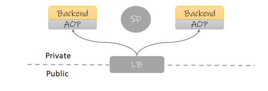
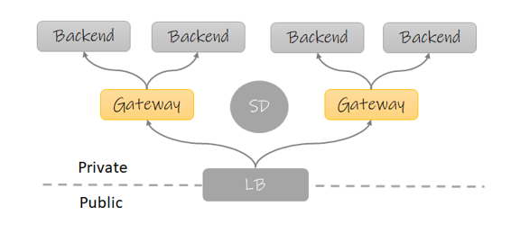
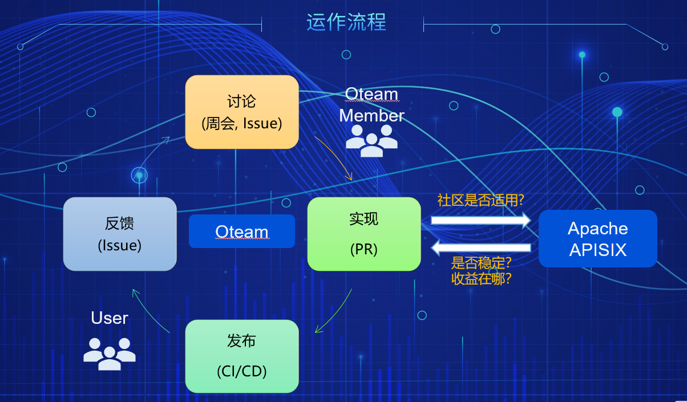
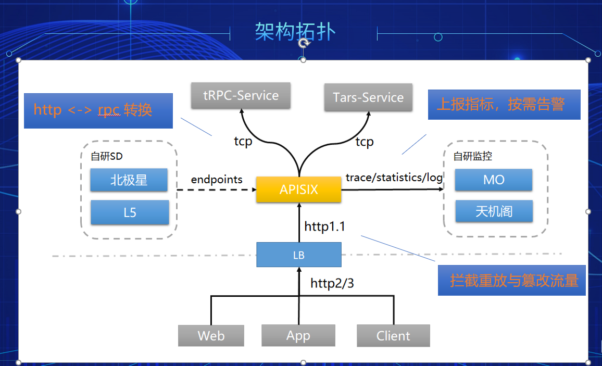
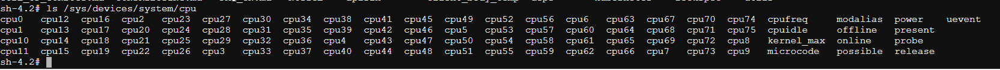
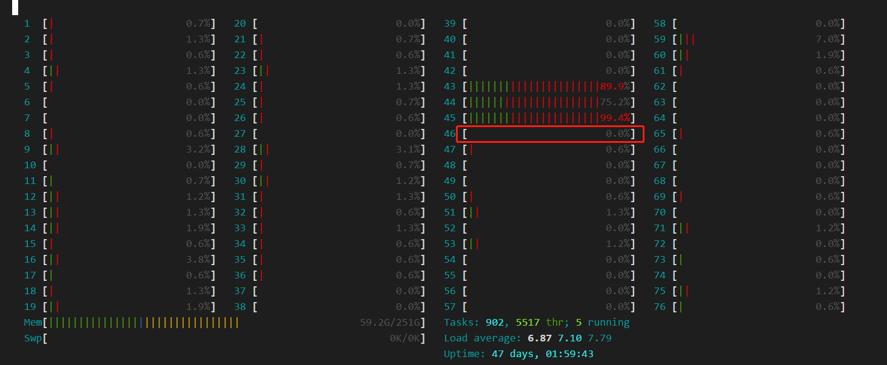
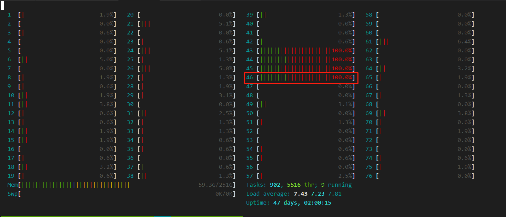
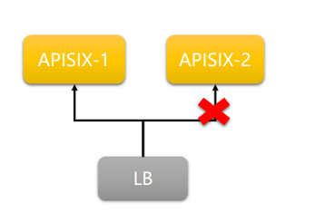
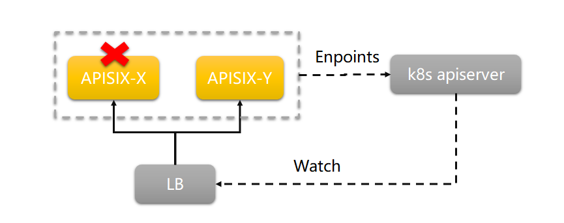

+++
title = "APISIX 与 腾讯 Oteam 的故事"
date = "2021-07-25T12:52:27+08:00"
author = ""
authorTwitter = "" #do not include @
cover = ""
tags = ["apisix"]
keywords = ["apisix"]
description = ""
showFullContent = false
+++

# APISIX 与 腾讯 Oteam 的故事
*本文内容来自 Apache APISIX Meetup 的同名分享*

在开始介绍正文之前，我们有必要先了解一下 `网关(Gateway)` 的作用和价值。

## 网关是什么
在传统的架构中，没有网关，那么通用功能该怎么复用起来呢？这里的通用功能指业务无关的一些特性，比如：
- 安全性：身份验证、授权、防重放、防篡改、对抗 DDos 等
- 可靠性：服务降级、熔断、限流等

这些功能在传统架构下，最常见的处理方法就是将其放入服务框架当中，通过 AOP 的方式去实现，类似下图：



模块：
- `Backend`: 后端服务
- `AOP`: 框架携带的 AOP 分层
- `SD`: 服务中心，用于服务间发现，此组件在云原生环境下经常用 Service 替代
- `LB`: 负载均衡器，放置于网络边界上，作为外部流量的入口

这种架构在早些年的设计中非常常见，因此诞生了很多大而全的服务框架，比如 Dubbo, SpringCloud 等，你认真去看看它们的功能介绍，我相信刚才提的那些功能点它们大多都有。
这种架构的优点在于上下游关系简单，网络传输中也少了一次转发。但是缺点也很明显：
- 通用功能的迭代会迫使业务服务更新：由于采用的是代码引用，因此需要业务服务重新编译才能使功能生效。对一些没有实现平滑发布的团队，由于服务会中断，因此还得挑业务的空闲期发布。
- 版本难以管理：由于你不可能每次发布都让所有业务服务升级最新版，长此以往，各个服务的版本将会不一致。

那么我们是否可以将这些通用功能下沉到一个独立的服务，它可以单独迭代且业务无关？
这就促使了网关模式的出现：




图中可以看到大部分内容都没有变化，只是在后端服务与LB之间多出了一个角色：网关。
这里需要澄清的是，网关的设计在各种场景下都有使用，但是本文讨论的网关特指 `ApiGateway` 即针对后台服务以 API 提供服务的场景，其他比如流式传输的场景，笔者也没有项目经验，暂不讨论。
注意在上面的这个图中，有时 LB 的角色同时也是网关，比如作为 k8s 的 `Ingress` 时。

有了网关这个服务后，我们就可以将这些通用功能下沉到网关，这样一来我们获得了以下好处：
- 网关可以独立迭代，不再需要业务服务配合
- 语言无关，可以配置专门的团队维护

但是网关模式也有自己的缺点：
- 多了一次转发，延迟变高，排查问题复杂度变高
- 网关如果处理不好可能成为整个平台的瓶颈

## 概念介绍
接下来就是本文要介绍两个重点对象：腾讯OTeam 和 Apache APISIX。

### OTeam
很多人对腾讯内部的赛马文化恐怕早有耳闻，在腾讯内部，老板们为了创造更有竞争力的产品，通常会让不同的队伍去同一个赛道竞争，这样虽然成本上去了，却有更高的几率诞生一些精品。
由于产品的竞争关系，下面的技术当然也不会共享，因此导致早期的腾讯在技术沉淀方面是互联网大厂中垫底的那个，在其他几家互联网大厂都相继在中台发力时，腾讯也幡然醒悟，为了整合公司内的重复轮子，沉淀技术中台。腾讯开展了一种技术写作形式，类似于 Github 的组织，将相同性质的几个技术产品都放入同一个 Oteam，将维护人员都整合起来，一起发力，让这些产品逐渐合并成一个大而全的产品，这就是 Oteam。

有的 Oteam 下面有多达十数种产品，而有的只有一种。比如 APISIX 在内部的 Oteam，就单单只有 APISIX 一个产品。我们成立这个 Oteam 的初衷也很简单：为 APSIXI 维护一些腾讯内部的定制化特性。

### Apache APISIX
这个我就不多介绍了，有兴趣的同学可以直接查看他们的 [Github](https://github.com/apache/apisix)，这里只简单介绍几个点：
- 基于 Openresty 的高性能网关，比起竞品 KONG 优势在于路由性能高了一个数量级
- 使用 ETCD 作为配置存储，实现配置秒更新
- Apache 毕业最快的项目之一


### OTeam 的运营策略
前面提到我们成立这个内部 OTeam 的目的是为了维护腾讯内部的特性，那么我们可以来看下正常我们OTeam 是怎么运作，又如何和 Github 的社区形成双赢的关系，OTeam 的运作参考下图：



上图可以看到我们的特性迭代是一个完整的闭环：
- 用户通过 `Issue` 反馈问题和需求
- OTeam 的成员 在 `周会` 上讨论解决方案，或者直接在 `Issue` 中跟进
- 按照解决方案实现特性 or 修复Bug
- 代码 Review 后，经历 CI 合入到主干中，再视情况需不需要打包镜像发版

这个流程其实和 Github 多数开源项目的贡献过程是没区别的，关键点在于：
- 解决了 Issue 后我们会判断这个问题对于社区来说是否也是一个共性问题，如果是，则会 PR 到社区的仓库去
- 同时我们也会定期 Review 社区的特性，判断是否稳定，是否对我们内部是否也是一个痛点

其实最早期的时候，我们会定时每 `12` 小时，自动合入社区代码到我们内部仓库中，以保证我们与社区能够共同前进，但遗憾的是这种做法带来了几个问题：
- 合入的代码通过目前的集成测试只能保证功能 `正确性` 却没法保证 `稳定性`，很多偶现的问题都是在并发中发生的
- 合入的后代，经常由于冲突而发生失败，根本原因在于上游的多个 PR 在逻辑上出现了冲突，但是各自的 CI 是无法检测出来的，只有当合入主干后，才会主干的代码已经有问题了。

出于以上原因，我们现在才会转为定期 Review 后合入所需特性的策略。

### OTeam 发展情况
截止 2021年5月，OTeam 在腾讯内部已落地 `10+` 团队，其中最大的业务日请求量已超过十亿，同时我们迭代了 `10+` 内部特性，其中包括内部的服务发现、RPC协议转换、打通监控平台等。

与此同时，我们也将一些通用的特性贡献到了社区，因此为社区带来了不少 Contributor。目前我们 OTeam 团队中有两位成员同时也是 ApacheAPISIX 社区的 PMC，整个 OTeam 为社区贡献了不下 `50` 个PR，相信以后会有更多合作的地方。

## 内部特性介绍
前面说过，OTeam 是的主要职责是维护 APISIX 的一些针对腾讯内部的特性，那么我们就来看看这些特性都是哪些，又解决了什么样的痛点。

### 内部的痛点
先来看看，有哪些痛点是我们内部独有的：
- RPC框架对前端不友好：腾讯内部有很多遗留项目使用了 `TARS` 框架，它不像 `TRPC` 一样可以直接支持 http 协议，它只支持 RPC 框架最传统的 tcp 协议，传输内容都使用特定的二进制协议，这带来的一个问题就是，你还需要维护一个中间服务来将这些接口转换为前端友好的 http + json 形式
- 服务中心多样化：腾讯内部服务发现的组件众多，比如 CL5,L5，北极星等等，虽然未来都会逐渐统一，但在过渡期间，一定会存在多个服务中心同时使用的情况，最开始的 APISIX 是不支持这一点的。
- 告警：作为一个网关解决方案，告警并不是一个它应该关注的方向，但是作为网关这个基础组件，告警一定是团队所关心的事项，要怎么解决告警问题，也是我们遇到的一个痛点
- 安全性：腾讯这种体量的公司，除了产品本身流量大之外，还有一个很重要的点就是安全性。在使用我们 OTeam 的版本的团队中不乏 ToC 的产品，他们要面对的不止海量用户的误操作，还要面对来自网络的攻击，无论是善意还是恶意的（除了恶意攻击外，也会有很多白帽探测这些产品，如果发现漏洞的话他们会提交到腾讯的平台以获取奖励），最典型的DDos, 重放，篡改请求等，我们是否可以在网关层解决掉。
（当然比如 DDos 这样的攻击其实在接入层就已经被干掉了，但是接入层只关心连接的信息而不会检测数据包的具体内容，所以剩下的问题还是要业务方来克服。）

带着这些问题，让我们来看看一个架构拓扑图，它来自一个腾讯内部某个落地case的简化：


从上图可以看出，刚才提出的几个问题在这里我们都得到了解决：
- 网关实现协议转换：这个其实类似的方案其实业界早就有了，比如 grcp-gateway 与 grpc 的关系，我们只是基于 APISIX 实现了 TRPC 与 TARS 的协议转换而已，这样一来那些没有实现 http 的遗留服务，可以在网关直接使用我们封装好的协议转换插件来实现 http 和 rpc 互转的需求而不再需要编写中间服务
- 支持多服务中心：这一点其实应该不止腾讯内部需要，相信外面也有很多同学在新老架构的过渡期需要，该特性我们已经合入到社区。
- 指标上报自研监控平台：同样，我们利用插件打通了公司内部的几个主要的监控平台，让用户可以简单配置后自动上报接口可观测性的相关信息（链路调用、日志、统计），上报后用户可自行在监控平台配置告警
- 防重放与防篡改：我们还是实现了防重放和防篡改插件，让需要对外的业务可以直接开箱即用这些能力，保护自己的接口安全。

我举的这些例子只是一些有代表性的，关于我们怎么定制 APISIX 来服务于腾讯内部的不同团队，希望这能为读者抛砖引玉，去发掘更多的场景（比如我了解到腾讯云团队就有同学利用网关来实现一些腾讯云平台强制要求的 API 规范，而将这逻辑下沉到了网关）。

## 踩坑详情
OTeam 在支持业务落地的过程中，也遇到不少坑，有些问题其实很简单，但是带来的影响却很大。
下面我就来分享几个在不同团队都反复出现过的问题点。注意这些问题跟云原生环境息息相关，因为我们的网关基本都部署在云上，有些问题可能在物理机的环境下你是不会遇到的。

### CPU 突然打满
现象：很多线上服务突然告警，CPU全部打满，持续一段时间后 Crash

这个问题其实一开始完全没想到和网关有关系，笔者本身负责腾讯游戏的容器平台，某一天好几个不同业务的开发找到我，说服务触发告警了，没有错误日志，但是CPU跑满。经验告诉我很可能是母机出了问题，不然不会导致不同业务的服务同时出问题。观察母机，果然 CPU 跑满了，检查了网络IO 和 磁盘IO 都是正常的，再一看容器的数据盘，满了。分析了下文件的归属，发现是其中一个业务的网关(使用了 APISIX)日志文件。和业务讨论后，删除了部分旧日志，一切正常。

有同学可能会问，为啥磁盘慢了导致这样的现象，是因为多数服务的写日志全都是同步的，如果磁盘满后整个。

当然刚才这个问题还没完，核心问题是 `为什么会写满磁盘`。正常对于流量高的服务，尤其是网关这样的基础设施，访问日志的容量规划是一定要考虑的事情，日志肯定不能无限制写下去，所以这时候就需要滚动，只留下最近一段时间的。看了下 APISIX 其实是实现了滚动日志的，但是并没有开启，建议在容器环境下 `一定开启滚动日志`，否则影响的可能不止网关。

```yaml
plugins:
  # enable the plugin
  - log-rotate

plugin_attr:
  log-rotate:
    interval: 3600    # rotate interval (unit: second)
    max_kept: 168     # max number of log files will be kept
```

### 性能低于预期
现象：垂直升配，性能却没有提升

相信有不少用户是冲着 APISIX 的高性能而来，在官网上能够看见 APISIX 在无插件的情况下压测性能能够达到 `1.8w` QPS，但是我们容器平台的用户有一台反馈，APISIX 在平台上实测性能居然只有 `5k` QPS，更让人吃惊的是，线性的垂直升配对性能的提升寥寥无几：
- 1核2G：`5k` QPS
- 2核4G: `8k` QPS
- 4核8G: `10k` QPS

其实最早在项目中落地 APISIX 时，我们对网关压测过，空跑性能其实是能接近官方给出的数据的。但是为何在容器环境下的表现会如此糟糕？经过仔细观察发现以下两个关键原因：
- 无法获取容器准确核数
- 配置了多核的情况下吞吐量增长非线性

#### Nginx的CPU相关设置
首先看看第一个问题：**无法获取容器准确核数**，这个问题的起因是因为在 Nginx 配置中使用了
```
worker_processes auto;
```
`auto` 意味 Nginx 会自动获取 CPU 核数，然后根据核数创建 worker。不幸的是，在容器当中它获取到的是 **母机的核数** 导致 Nginx 会在容器中创建数十个甚至上百个 worker，多个 worker 间的资源竞争和上下文切换都会降低它的性能。
为了核验 Nginx 是否真的获取的是母机核数，我翻了下 Nginx 相关的代码，截取核心片段如下：
src/os/unix/ngx_posix_init.c
```c
#include <ngx_config.h>
#include <ngx_core.h>
#include <nginx.h>


ngx_int_t   ngx_ncpu;
ngx_int_t   ngx_max_sockets;
ngx_uint_t  ngx_inherited_nonblocking;

...

#if (NGX_HAVE_SC_NPROCESSORS_ONLN)
    if (ngx_ncpu == 0) {
        ngx_ncpu = sysconf(_SC_NPROCESSORS_ONLN);
```
查看 [sysconf](https://man7.org/linux/man-pages/man3/sysconf.3.html) 的文档发现底层调用的 [ get_nprocs_conf(3)](https://man7.org/linux/man-pages/man3/get_nprocs_conf.3.html), 继续查看它的[源码](https://code.woboq.org/userspace/glibc/sysdeps/unix/sysv/linux/getsysstats.c.html#__get_nprocs_conf)，核心片段如下：
```c
/* On some architectures it is possible to distinguish between configured
   and active cpus.  */
int
__get_nprocs_conf (void)
{
  /* XXX Here will come a test for the new system call.  */
  /* Try to use the sysfs filesystem.  It has actual information about
     online processors.  */
  DIR *dir = __opendir ("/sys/devices/system/cpu");
  if (dir != NULL)
  ...
```
注意这个路径 `/sys/devices/system/cpu`，随便进入到一个容器中，ls 一下它你会发现它是母机的CPU信息，类似下面：


OK，第一个问题至此已确认完毕，我们先看看第二个问题再讨论解决方案，因为看上去它们应该是关联的。

#### k8s的CPU策略
关于第二个问题：**配置了多核的情况下吞吐量增长缓慢**，直觉这个问题跟另一个 Nginx 的配置参数有关：`worker_cpu_affinity`，它可以指定 Nginx绑定到几号核。手动指定的场景我们直接跳过，通常我们都是使用 `auto` 参数。看下当设置 auto 时，Nginx 会怎么绑定CPU，核心代码片段如下：
src/core/nginx.c
```c
    if (ngx_strcmp(value[1].data, "auto") == 0) {

        if (cf->args->nelts > 3) {
            ngx_conf_log_error(NGX_LOG_EMERG, cf, 0,
                               "invalid number of arguments in "
                               "\"worker_cpu_affinity\" directive");
            return NGX_CONF_ERROR;
        }

        ccf->cpu_affinity_auto = 1;

        CPU_ZERO(&mask[0]);
        for (i = 0; i < (ngx_uint_t) ngx_min(ngx_ncpu, CPU_SETSIZE); i++) {
            CPU_SET(i, &mask[0]);
        }

        n = 2;

    } else {
        n = 1;
    }
```
可以看到CPU的绑核策略是顺序从低位到高位，这样做在普通的物理机本来没什么问题，但是在 k8s 的环境下就不行了，原因有两个：
- 绑核动作需要特权执行，通常 POD 是没有权限的
- 在于 k8s 在`static` 策略下本来就会对 limit 为整数的 `Guaranteed` POD进行绑核处理，可以参考 [控制节点上的 CPU 管理策略](https://kubernetes.io/zh/docs/tasks/administer-cluster/cpu-management-policies/) 。

所以云上应用都不建议再去应用进行绑核操作。

回过头来说 Nginx 自动从低位CPU绑到高位的这个操作，没有特权的情况会怎样？上面的代码片段我们看到它使用了 `CPU_SET` 这个系统调用，相关的方法签名如下：
```
void CPU_SET(int cpu, cpu_set_t *set);
```
意味着无论绑核成功或失败，**程序都得不到响应**。为了验证这个结论，我们创建一个 Nginx 应用( 1c1g )，然后在容器执行以下命令查看绑定的核：
```
sh-4.2# cat /sys/fs/cgroup/cpuset/cpuset.cpus
45
```
可以看到绑定到了第45号核(由0开始)，在母机上执行 `htop` 可以看到这里的第46号核(由1开始)，完全没有使用率：


开始执行压测后：


很明显，Nginx 绑核并没有成功，容器依然绑定在原来的CPU上。
通常来说，没有特殊原因都不建议云上应用再去执行绑核操作，保持不变即可。

#### 方案对比
开始我以为多核无法利用的情况，是容器绑定的核与应用绑定的核只有小部分重叠，所以才导致无法有效利用。但现在看来，没有 **特权** 的 Nginx 甚至连绑核都做不到，那么我们要继续考虑其他可能的问题。
测试以下情况：
| 情况 | QPS | CPU使用率 |
| --- | --- | --- |
| 1c2g-1workers | 10959.22 | 100% | 
| 2c4g-1workers | 11845.91 | 100% |
| 2c4g-2workers | 16975.04 | 200% |
| 1c2g-1workers * 2 | 22492.83 | 200% |
| 4c8g-2workers | 20506.10 | 200% |
| 4c8g-4workers | 31012.40 | 400% |
| 1c2g-1workers * 4 | 51720.11 | 400% |
| 1.001c2g-1workers * 4 | 47501.16 | 401% |

几个比较有代表性的 case 这里解释一下：
- `1c2g-1workers`: 这是理想的状态，1核对应一个 worker
- `2c4g-1workers`: 垂直升配的情况下，一个 worker 是无法利用多核的
- `2c4g-2workers`: 将 worker 提升到了2，可以看到利用率和QPS都有所提升
- `4c8g-4workers`: 将 worker 和对应配置都提升到了4，会发现性能曾并非线性增长
- `1c2g-1workers * 2`: 同样的配置，拆分为两个容器后，可以看到吞吐量是线性增长的，这是因为 Worker 只有一个，所以不存在竞争

这里我们可以看到使用多个单核的容器会比使用多核的单个容器具有更高的吞吐量，可能的原因有两点：
- 多个worker间存在资源竞争
- 单核容器由于可用核只有一个，所以相当于进行了绑核操作

为了排除第二个原因的影响，我补充图表中的最后一个用例(1.001c2g-1workers * 4)，这个用例中由于cpu不是整数核，所以没有分配独占cpu。可以发现它的吞吐量下降了8%左右，证明绑核还是有效果的。

此外，有兴趣的同学可以实测下面的两个 case：
- `1c2g-88workers`： 这是我们用户遇到低性能的 case 因为母机的核数是 88，所以 Nginx 自动启了 88 个 worker, 用户反馈这个情况下 QPS 只有 `5k` 左右
- `32c64g-32workers`: 这个 case 可以侧面反馈出在高配环境下 nginx 的损耗有严重，由于资源受限的问题，当时没有进行

#### 结论
通过以上的实验，我们可以得出几个关键点：
- worker 少于 cpu 数量时无法充分利用 cpu
- 云上的 Nginx 最好使用 **单核多容器** 的部署模式，这样可以充分利用k8s的cpu策略进行绑核，单worker也是Nginx的推荐设置，如果要设置多个 worker，那么不要使用 `auto` 参数，获取到的将会是母机核数
- 如果要使用多核的情况下，尽量不要使用过大的cpu数量，推荐最多 `8` 个，否则 worker 数量过多会造成大量资源浪费在处理竞争上
- 云上不要使用 `worker_cpu_affinity=auto`，因为除了需要特权外，顺位绑核的操作不一定能绑定到 k8s 分配的独占核，极端情况下还会导致不可用，所以在云上环境多结合 k8s 的 CPU策略 来使用才是最佳实践

最后可能有同学会问，为啥你测试出来的单核性能只有 `11k` 左右，与官方的压测结果还是差了不少，这里需要同步一个信息，当时用于压测的环境是在腾讯的TKE上，而他们的 GR（全局路由） 网络模式在低版本内核中是有 bug 的，会导致网络吞吐量比正常情况下低 `60%` 左右，所以这个结果最后可以认为与官方的压测结果差距不大。因为云上网络大部分都是虚拟的，所以性能会收到网络组件的很大影响。本文的核心目的也只是想验证 Nginx 本身与 Linux 的关系，所以暂时不讨论平台本身的差异性。

### 平滑发布
现象：网关发布时会导致服务端出现中断

网关作为南北向流量入口的重要组件，它的发布会影响到很多业务服务，所以平滑发布是非常重要的。在以往的物理机环境中，我们可以通过 APISIX 的插件热加载功能来实现 `插件的热更新`，在加上 Nginx 本身已经实现了热更新，运维只要编写一些脚本就可以 hold 住发布的情况。可是容器环境下，你不可能逐个pod去更改这些东西，既繁琐也不优雅。

那么容器环境下该如何做到平滑发布？首先可以确定的一点就是：我们一定要 `销毁 Pod 再重建`，因为这是作为一个无状态服务的最佳发布方式，在这个前提下我们再来继续讨论如何做到平滑。

正常在云原生环境常见的网关部署方式有几种：
- LB 访问固定的网关 IP： 这在 腾讯IEG 处于过渡期的项目有很多都是这样的架构
- LB 通过 Service 发现 网关：新的服务体系基本都是采用这种方案
- 网关直接对接外部流量：这在腾讯是不存在的，因为对外的风险很高，一定是要通过接入层保护才能为服务规避很多风险

接下来逐个场景讨论。

#### LB 访问固定的网关 IP
示意图如下：



在 LB 填写固定的网关IP 其实是一个非常不好的设计，但是早期由于基础设施的一些技术尚未落地，只能选择这种方式。当网关发布，Pod 被销毁重建时，不可避免会导致请求失败，这个时候我们可以在 LB 做一些规避手段：
- 对网关进行心跳，防止将流量送到正在发布的 Pod
- 做好重试，当在健康检查的间隔时间内将流量送到了不可用的 Pod 时，需要及时重试
- 网关的发布策略一定要选择 `滚动升级`，不要一次性更新所有 Pod，否则还是会出现中断

做到以上几点，就可以做到业务无中断发布。但这里我还是要提一下这种架构几个很明显的缺点：
- 网关扩容需要修改LB配置，这是很不好的，如果你想把这个也自动化，还需要做更多的工作。
- 在 LB 进行重试和心跳会有性能损耗

那我们有没有更优雅的解决方案呢？有，那就是 LB 不需要人工配置，而直接通过 `k8s apiserver` 来获取网关的地址，接下来我们看看第二种架构

#### LB 通过 Service 发现 网关
这种架构下，LB 通过访问 `k8s apiserver` 来获取网关的地址，不再需要人工或者脚本去配置。


由于 k8s 已经自带了完善的健康检查和优雅退出机制，所以在这个架构下，LB 是不需要第一个方案下那些规避手段的（当然如果有会更好），正常你只要注意下以下几点即可：
- 对网关配置好健康检查，防止发布过程中 Pod 尚未就绪就把流量转到了新起的 Pod 中
- 由于 k8s 销毁 Pod 和 从 `Service(Endpoints)` 中剔除这个 IP 是并行发起的，所以有可能在 Pod 销毁后还有请求会被送过来。这时可以通过 `preStop` 来执行 `sleep` 等待流量先被摘除后再进行销毁。


你可以发现，当我们活用好 k8s 本身的一些机制后，我们就不再需要严格要求 LB 去承担检测的职责，而只需要关注路由和安全等等，这样对于一些初创团队来说，在LB的方案上会有更多选择空间。

#### 网关直接对接外部流量
这个架构可能在初创型公司会比较多，网关直接对外，比如作为 `Ingress` 当做集群的流量入口。由于腾讯没有这样的案例，所以这里不展开讨论了，其实平滑发布的核心点在于：要与 k8s 联动起来，否则必然需要转发方做好兜底手段。

## 最后的话
转眼在公司内帮助各个团队 APISIX 也一年多了，在这个过程中既帮助了业务解决他们的痛点，也不断完善了 APISIX 在腾讯内部的特性，同时也间接推动了社区的发展，真的是一个双赢的事情。读者如果还没有落地网关的话，可以了解下 APISIX。已经落地了网关的读者，也希望本文能够给你们带来一点在网关落地上的灵感和帮助。