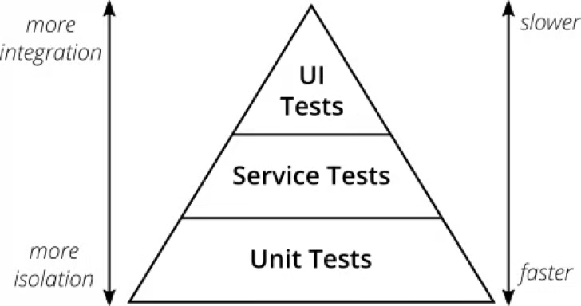
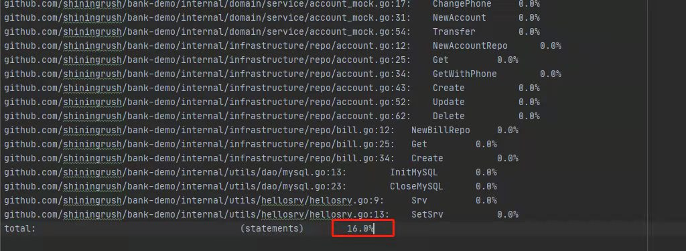
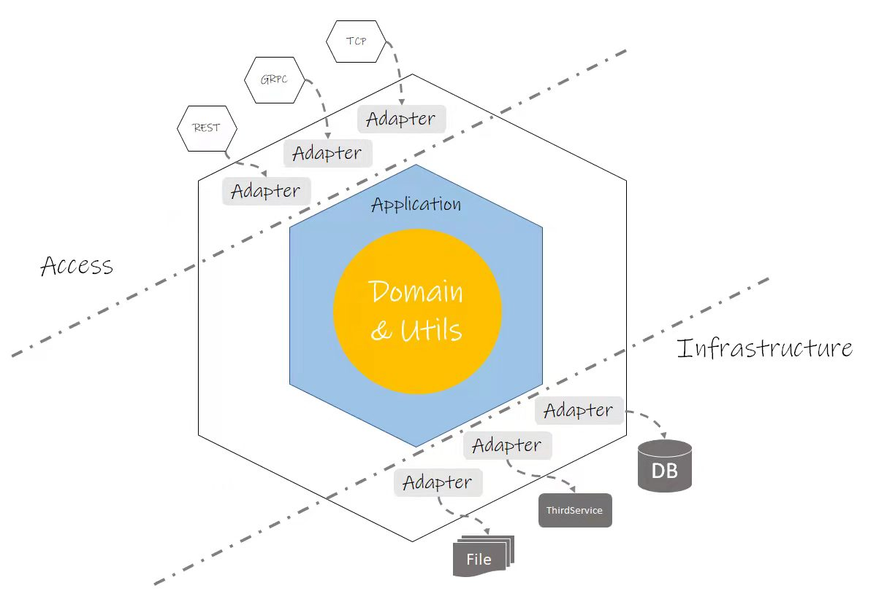

+++
title = "如何在Go中优雅地进行测试"
date = "2021-02-12T15:09:23+08:00"
author = ""
authorTwitter = "" #do not include @
cover = ""
tags = ["unit-test"]
keywords = ["unit-test", "go"]
description = ""
showFullContent = false
+++

# 如何在Go中优雅地进行测试
> 本文是 `快速迭代中保证项目的高质量——DevOps实践漫谈`，一文中关于测试的延伸阅读，主要展示在 go 项目中该如何去做测试，以及测试是如何驱动设计的演化。 虽然是以 go 为示例，但里面的多数测试方法和思想都与语言无关，不会 go 的同学也可以阅读。

## 简述
测试的重要性这里不多复述，可以参考我关于 `单元测试的必要性?由谁来写`  的 [回答](./about-unit-test.md)。
测试分为很多种，本文这次要讨论的是关乎后台服务最重要的两种测试：`单元测试` 与 `集成测试`。它们两属于测试金字塔图的最下两层，如下图：


图中位于第二层的测试名为服务测试(Service Tests) ，其实它职责包含了狭义的集成测试，我将其理解为广义的集成测试。

开始进入主题之前，我觉得应该和阅读的同学对齐一下一些概念，因为关于测试的术语网上各种概念都各不相同，我这里只列举本文会使用到的一些概念( 这些是我的理解，并不一定完全恰当与正确 )：
- 模块： 指逻辑上紧密耦合的一组函数，通常它们会以对象形式实现，以接口的形式提供给其他模块使用。
- 外部环境：数据库，文件系统，其他服务等
- 单元测试：对于单个模块的测试，此时应该通过桩模块隔离被测模块以外的模块
- 桩(stub)：用于在单元测试中替换被测模块的依赖模块，使其总是返回我们期望的值
- 集成测试：狭义的集成测试只测试那些访问外部环境的代码，比如：
  + 读写数据库
  + 调用外部服务的 API
  + 读写队列
  + 读写文件

广义的集成测试指对整个服务进行测试，包括外部环境与所有模块。
从概念上我们可以看出集成测试是最能保证业务价值的，但是由于需要集成的东西过多，所以它的执行很缓慢且用例容易失效（任何一个子模块的变动都可能让相关用例的数据不再有效），维护成本很高。所以测试金字塔为我们指出了测试中的一个最佳实践：`使用单元测试保障更多的边界境况，集成测试来确保模块与模块，模块与外部环境的正常集成`

接下来，让我们一起来看看在一个 go 项目中该如何落地这个最佳实践。

## 从一个简单的业务开始
让我们从一个简单的银行来开始我们的实践，假设有以下需求：

1. 用户需要用一个手机号码来创建一个账户，支持更换手机号
2. 支持付款、转账、销户
3. 需要记录账单流水

我们的需求非常简单，但已经足够用于展示了。

### 基础环境准备
由于需求的简单性，这里我们直接跳过建模分析的过程，把DDL放在下面：

```SQL
SET FOREIGN_KEY_CHECKS=0;

-- ----------------------------
-- Table structure for accounts
-- ----------------------------
DROP TABLE IF EXISTS `accounts`;
CREATE TABLE `accounts` (
  `id` int(11) NOT NULL AUTO_INCREMENT,
  `phone` varchar(16) NOT NULL,
  `balance` double NOT NULL,
  `status` varchar(16) NOT NULL,
  `created_at` datetime NOT NULL,
  `updated_at` datetime NOT NULL,
  PRIMARY KEY (`id`)
) ENGINE=InnoDB AUTO_INCREMENT=21 DEFAULT CHARSET=utf8;

-- ----------------------------
-- Table structure for bills
-- ----------------------------
DROP TABLE IF EXISTS `bills`;
CREATE TABLE `bills` (
  `id` bigint(20) NOT NULL AUTO_INCREMENT,
  `desc` varchar(128) NOT NULL,
  `account_id` int(11) NOT NULL,
  `amount` double NOT NULL,
  `created_at` datetime NOT NULL,
  PRIMARY KEY (`id`)
) ENGINE=InnoDB DEFAULT CHARSET=utf8;
```

### 开始开发
本次的业务场景采用 `DDD(领域驱动设计)` 的设计风格开发，但不会展开说明，因为这是一个很大的话题，有兴趣了解的同学可以找我私聊，或者评论留言，我可以把自己过往实践 DDD 的经验再单独写一篇文章。

在本次的场景下，我们可以很容易得到下面两个 实体(Entity):
```go
type Account struct {
	ID int
	Phone string
	Status AccountStatus
	Balance float64
	CreatedAt time.Time
	UpdatedAt time.Time
}

type AccountStatus string
const (
	AccountStatusNormal AccountStatus = "normal"
	AccountStatusClosed AccountStatus = "closed"
)

type Bill struct {
	ID int
	Desc string
	Type BillType
	AccountId int
	Amount float64
	CreatedAt time.Time
}

type BillType string
const(
	BillTypeCost = "cost"
	BillTypeEarn = "earn"
)
```

### 实现并测试业务逻辑
我们抛开这些实体是如何读取以及存储的，让我们着眼本次场景中那些跟技术弱相关，而与业务强相关的逻辑：`业务逻辑`，我们按照以下的顺序来逐个实现它们：
- 创建账户
- 更换手机号
- 付款
- 转账
- 销户
- 保存流水

#### 创建账户
由于创建账户需要保证 电话号码 的唯一，所以需要了解已存储的 账户是否已使用了新注册的号码，这个时候我们可以使用 DDD 中的 `仓储(Repository)` 来代替对数据库的依赖，分别建立 `账户` 和 `账单` 的 仓储。
account
```go
package account

type Repo interface {
	Get(id int) (*entity.Account, error)
	GetWithPhone(phone string)(*entity.Account, error)
	Create(account entity.Account)(*entity.Account, error)
	Update(account entity.Account)(*entity.Account, error)
	Delete(id int) error
}
bill

package bill

// Repo bill repository
type Repo interface {
	Create(account entity.Bill)(*entity.Bill, error)
}
```

这里我只创建了接口，但是这样足够了，因为 `业务逻辑` 并不关心技术细节 。
由于 `账户` 手机号码为必须的，所以我们可以在构造函数上体现这一点

```go
func NewAccount(phone string) Account {
	return Account{
		Phone:     phone,
		Status:    AccountStatusNormal,
		Balance:   0,
	}
}
```

接下来，由于需要访问 `仓储` 所以这里使用 DDD 中的 `领域服务` 来实现创建新账户的逻辑（ 简单来说 `领域服务` 就是指某些业务逻辑没办法单纯由一个 `实体` 完成，或者需要了解其他 `实体` 的生命周期，这样不适合放入它的业务逻辑，可以由 `领域服务` 来承载 ）

```go
package service

type Account interface {
	NewAccount(phone string)(*entity.Account, error)
}

type accountService struct {
	accRepo account.Repo
}

func NewAccountSvc() Account {
	return &accountService{
		accRepo:  account.NewRepo(),
	}
}

func(svc *accountService) NewAccount(phone string)(*entity.Account, error) {
	if err := svc.isPhoneAlreadyInUsed(phone); err != nil {
		return nil, err
	}

	newAcc := entity.NewAccount(phone)
	return &newAcc, nil

}

func(svc *accountService) isPhoneAlreadyInUsed(newPhone string) error {
	acc, err := svc.accRepo.GetWithPhone(newPhone)
	if err != nil {
		return err
	}

	if acc != nil {
		return fmt.Errorf("phone alreay be used")
	}
	return nil
}
```

我这里对这个 领域服务 也进行了抽象化，目的是为了给上层调用者提供解耦的方式，不过这种做法不是必须的，因为 go 推崇的是 `accept interface returns struct`，所以参数接受 `interface` 返回 `struct` 通常来说会更好些。
这个最佳实践是由于 go 接口工作形式是基于模型定义的，即：如果任一结构体实现了接口定义的行为，那么则认为结构体实现了该接口，这跟传统的面向对象语言有很大不同，go 的接口和实现并没有直接的依赖关系，这样调用方完全可以使用自己定义的接口来接受第三方返回的结构体从而把定义抽象的权力也给予了调用方，使得调用方不用再关注提供方是否定义了接口或者接口是不是足够清晰。那什么时候我们需要返回 接口 呢，答案是，当你想要调用方只关心行为时。
作为 领域服务，通常上层调用者都是 应用层 逻辑，我肯定不希望应用关心服务是怎么实现的，而只需要调用这个行为即可，所以这里提供了接口。

完成代码后，让我们来测试下这段代码的正确性。我们这个需求涉及到几个明显的用例：

- 正常注册：得到一个 账户 实体，我们需要检查 账户 是否已经被正常地赋值
- 手机号重复：得到一个特定的错误信息。
- 意外错误：得到错误的原因。

为了能够制造出特定的情况，比如手机号重复，我们需要 `仓储` 的 `GetWithPhone` 返回我们期望的结果，这时我们就需要对 `仓储` 进行 `打桩`，也就是使用一个模拟的 `结构体` 来实现我们的期望。
我们可以简单地新建一个 `StubRepo` 来实现，如下：
```go
type stubAccountRepo struct {
}

func(r *stubAccountRepo) Get(id int)(*entity.Account, error) {
	return nil,nil
}

func(r *stubAccountRepo) GetWithPhone(phone string)(*entity.Account, error) {
	if phone == "testphone" {
		return &entity.Account{}, nil
	}
	return nil,nil
}

func(r *stubAccountRepo) Create(account entity.Account)(*entity.Account, error) {
	return nil, nil
}

func(r *stubAccountRepo) Update(account entity.Account)(*entity.Account, error) {
	return nil, nil
}

func(r *stubAccountRepo) Delete(id int) error {
	return nil
}
```

这个桩会在我们以 `testphone` 参数请求 `GetWithPhone` 的时候返回一个 `账户`，以满足测试的需要。
但是这里不推荐使用这样的方法，因为面对很多复杂场景，要么我们会出现多个 stub 的结构，或者出现一个非常复杂的 stub ，这都不是我们希望看到的。

所以我接下来要介绍另一种方法，让我们使用 [testify](https://github.com/stretchr/testify) 的 `Mocking`，它利用反射让我们可以使用一个通用的 mock 对象来按需返回结果。
使用之前需要创建一个 mock 对象，这个对象会实现目标接口的所有方法，推荐使用 [mockery](https://github.com/vektra/mockery) 来生成即可，执行：

```bash
mockery -all -inpkg -dir 你的接口所在目录
```

生成的代码类似如下：
```go
...
// MockRepo is an autogenerated mock type for the Repo type
type MockRepo struct {
	mock.Mock
}

// Create provides a mock function with given fields: account
func (_m *MockRepo) Create(account entity.Account) (*entity.Account, error) {
	ret := _m.Called(account)

	var r0 *entity.Account
	if rf, ok := ret.Get(0).(func(entity.Account) *entity.Account); ok {
		r0 = rf(account)
	} else {
		if ret.Get(0) != nil {
			r0 = ret.Get(0).(*entity.Account)
		}
	}

	var r1 error
	if rf, ok := ret.Get(1).(func(entity.Account) error); ok {
		r1 = rf(account)
	} else {
		r1 = ret.Error(1)
	}

	return r0, r1
}
...
```

接下来，让我们看看该如何使用它来帮助我们测试，直接上代码：
```go
func TestAccountService_NewAccount(t *testing.T) {
	tests := []struct {
		caseDesc     string          // 用例简述
		givePhone    string          // 执行用例的输入电话
		giveAcc      *entity.Account // mock的仓储中返回的账户
		giveErr      error           // mock的仓储函数返回的错误
		wantErr      error           // 执行后期望的错误
		wantAcc      *entity.Account // 执行后 期望获得的新增账户
		wantRepoCall bool            // 用于判断仓储的指定函数是否得到调用
	}{
		{
			caseDesc:  "正常用例",
			givePhone: "right",
			wantAcc: &entity.Account{
				Phone:  "right",
				Status: entity.AccountStatusNormal,
			},
			wantRepoCall: true,
		},
		{
			caseDesc:     "手机号重复",
			givePhone:    "repeat",
			giveAcc:      &entity.Account{},
			wantErr:      fmt.Errorf("phone alreay be used"),
			wantRepoCall: true,
		},
		{
			caseDesc:     "调用 repo 错误",
			givePhone:    "right",
			giveErr:      fmt.Errorf("repo error"),
			wantErr:      fmt.Errorf("repo error"),
			wantRepoCall: true,
		},
	}

	for _, tc := range tests {
		t.Run(tc.caseDesc, func(t *testing.T) {
			isCalled := false
			mockRepo := &account.MockRepo{}
			// 对 GetWithPhone 进行打桩
			mockRepo.On("GetWithPhone", mock.Anything).Run(func(args mock.Arguments) {
				// 当桩函数被调用时，我们做一个标记
				isCalled = true
			}).Return(tc.giveAcc, tc.giveErr)

			svc := accountService{
				accRepo: mockRepo,
			}
			acc, err := svc.NewAccount(tc.givePhone)

			// 检查期望的结果
			assert.Equal(t, tc.wantErr, err)
			if err != nil {
				return
			}
			assert.Equal(t, tc.wantAcc, acc)
			assert.Equal(t, tc.wantRepoCall, isCalled)
		})
	}
}
```
这里我使用了 `匿名结构体` 在一个测试函数中聚合了所有的用例，这跟以前写 c# 和 java 的时候有很大不同，后两者的习惯是每一个测试函数对应一个用例，比如上面的用例可能会变成一下几个函数

```go
...
func TestNewAccount_Sanity(t *testing.T) 
func TestNewAccount_ConflictPhone(t *testing.T) 
func TestNewAccount_CallFailed(t *testing.T) 
...
```

刚转 go 时我也是按照以前的风格写用例，后来接触 go 的一些开源项目后我发现了这种声明式的测试函数编写方法：将测试逻辑放入函数，用例输入与期望抽象为函数入参。这种测试风格被称为 `测试用例表(test case table)`
我一下就爱上了这种测试函数的编写方式，既优雅又清晰。回到刚才的用例，让我们执行一下用例，全部通过。

```bash
=== RUN   TestAccountService_NewAccount
--- PASS: TestAccountService_NewAccount (0.00s)
PASS
```
但是在测试过程中，我建议大家先故意写错期望结果让测试用例失败，再纠正让其正常，这是为了验证 `测试逻辑` 本身的正确性

#### 更换手机号
更换手机号的逻辑重点在于：
- 确认手机号是否已被使用，这段业务逻辑可以直接复用之前提炼的 `isPhoneAlreadyInUsed` 方法
- 确认要修改的账户是否存在

实现代码片段如下：
```go
func (svc *accountService) ChangePhone(accId int, newPhone string) error {
	if err := svc.isPhoneAlreadyInUsed(newPhone); err != nil {
		return err
	}

	targetAcc, err := svc.accRepo.GetWithPhone(newPhone)
	if err != nil {
		return err
	}
	if targetAcc == nil {
		return fmt.Errorf("account id: %d not found", accId)
	}

	targetAcc.Phone = newPhone
	_, err = svc.accRepo.Update(*targetAcc)
	if err != nil {
		return err
	}
	return nil
}
```
相关的测试用例：
```go
func TestAccountService_ChangePhone(t *testing.T) {
	tests := []struct {
		caseDesc             string          // 用例简述
		giveAccId            int             // 要修改的账户ID
		givePhone            string          // 新的电话号码
		giveTargetAcc        *entity.Account // mock的仓储中 Get 返回的账户
		giveAcc              *entity.Account // mock的仓储中 GetWithPhone 返回的账户
		giveGetErr           error           // mock仓储的 Get 函数返回错误
		giveGetWithPhoneErr  error           // mock仓储的 GetWithPhone 函数返回错误
		giveUpdateErr        error           // mock仓储的 Update 函数返回错误
		wantErr              error           // 执行后期望的错误
		wantGetCall          bool            // 用于判断仓储的指定函数是否得到调用
		wantGetWithPhoneCall bool            // 用于判断仓储的指定函数是否得到调用
		wantUpdateCall       bool            // 用于判断仓储的指定函数是否得到调用
	}{
		{
			caseDesc:             "正常用例",
			giveAccId:            123,
			givePhone:            "right",
			giveTargetAcc:        &entity.Account{},
			wantGetCall:          true,
			wantGetWithPhoneCall: true,
			wantUpdateCall:       true,
		},
		{
			caseDesc:             "手机号重复",
			givePhone:            "repeat",
			giveAcc:              &entity.Account{},
			wantErr:              fmt.Errorf("phone alreay be used"),
			wantGetWithPhoneCall: true,
			wantUpdateCall:       false,
		},
		{
			caseDesc:             "要修改的账户不存在",
			giveAccId:            123,
			givePhone:            "right",
			wantErr:              fmt.Errorf("account id: 123 not found"),
			wantGetWithPhoneCall: true,
			wantUpdateCall:       false,
		},
		{
			caseDesc:             "调用仓储 getWithPhone 错误",
			givePhone:            "right",
			giveGetWithPhoneErr:  fmt.Errorf("giveGetWithPhoneErr error"),
			wantErr:              fmt.Errorf("giveGetWithPhoneErr error"),
			wantGetWithPhoneCall: true,
			wantUpdateCall:       false,
		},
		{
			caseDesc:             "调用仓储 get 错误",
			givePhone:            "right",
			giveGetErr:           fmt.Errorf("get error"),
			wantErr:              fmt.Errorf("get error"),
			wantGetWithPhoneCall: true,
			wantGetCall:          true,
			wantUpdateCall:       false,
		},
		{
			caseDesc:             "调用仓储 update 错误",
			givePhone:            "right",
			giveTargetAcc:        &entity.Account{},
			giveGetErr:           fmt.Errorf("update error"),
			wantErr:              fmt.Errorf("update error"),
			wantGetWithPhoneCall: true,
			wantGetCall:          true,
			wantUpdateCall:       false,
		},
	}

	for _, tc := range tests {
		t.Run(tc.caseDesc, func(t *testing.T) {
			isUpdateCalled, isGetCalled, isGetWithPhoneCalled := false, false, false
			mockRepo := &account.MockRepo{}
			// 对 Get 进行打桩
			mockRepo.On("Get", mock.Anything).Run(func(args mock.Arguments) {
				// 当桩函数被调用时，我们做一个标记
				isGetCalled = true
				// 确保输入的账户为用例中的账户ID
				assert.Equal(t, tc.giveAccId, args.Int(0))
			}).Return(tc.giveTargetAcc, tc.giveGetErr)

			// 对 GetWithPhone 进行打桩
			mockRepo.On("GetWithPhone", mock.Anything).Run(func(args mock.Arguments) {
				// 当桩函数被调用时，我们做一个标记
				isGetWithPhoneCalled = true
			}).Return(tc.giveAcc, tc.giveGetWithPhoneErr)

			// 对 Update 进行打桩
			mockRepo.On("Update", mock.Anything).Run(func(args mock.Arguments) {
				// 当桩函数被调用时，我们做一个标记
				isUpdateCalled = true
				// 确保输入的账户为用例中的账户ID
				acc := args.Get(0).(entity.Account)
				assert.Equal(t, tc.giveTargetAcc.ID, acc.ID)
				assert.Equal(t, tc.givePhone, acc.Phone)
			}).Return(tc.giveAcc, tc.giveGetErr)

			svc := accountService{
				accRepo: mockRepo,
			}
			err := svc.ChangePhone(tc.giveAccId, tc.givePhone)

			// 检查期望的结果
			assert.Equal(t, tc.wantErr, err)
			if err != nil {
				return
			}
			assert.Equal(t, tc.wantGetCall, isGetCalled)
			assert.Equal(t, tc.wantGetWithPhoneCall, isGetWithPhoneCalled)
			assert.Equal(t, tc.wantUpdateCall, isUpdateCalled)
		})
	}
}
```
#### 付款
付款的要点如下：
- 检测账户是否正常
- 余额是否充足
- 扣款，且生成流水账单

由于付款这个动作不涉及到存储内容，所以它完全可以由 账户 的实体来承载，代码片段实现如下：
```go
func (acc *Account) IsNormal() bool {
	return acc.Status == AccountStatusNormal
}

func (acc *Account) Cost(amount float64, desc string) (*Bill, error) {
	if !acc.IsNormal() {
		return nil, fmt.Errorf("only normal account can cost")
	}
	if amount > acc.Balance {
		return nil, fmt.Errorf("balance not enough")
	}

	acc.Balance -= amount
	return &Bill{
		Desc:      desc,
		AccountId: acc.ID,
		Amount:    amount,
		CreatedAt: time.Time{},
	}, nil
}
```
由于测试用例相关的代码篇幅都比较长，且上面已经展示过相关用例了，所以此后文章内不再展示，有兴趣了解的同学请自行到仓库下浏览。

#### 转账
转账关注以下几点：
- 双方账户是否正常
- 一方扣款，一方转入
- 保存汇款后状态，以及流水

由于转账这个动作涉及两个 `账户` 的状态变化以及保存，所以放入 `领域服务` 非常合适，代码片段如下：

```go
func (svc *accountService) getAccountAndCheckIt(accId int) (*entity.Account, error) {
	acc, err := svc.accRepo.Get(accId)
	if err != nil {
		return nil, err
	}
	if acc == nil || !acc.IsNormal() {
		return nil, fmt.Errorf("account: %d is not normal or not existed", accId)
	}

	return acc, nil
}

func (svc *accountService) Transfer(fromAccId, toAccId int, amount float64, desc string) error {
	fromAcc, err := svc.getAccountAndCheckIt(fromAccId)
	if err != nil {
		return err
	}
	toAcc, err := svc.getAccountAndCheckIt(toAccId)
	if err != nil {
		return err
	}

	costBill, err := fromAcc.Cost(amount, desc)
	if err != nil {
		return err
	}
	earnBill, err := toAcc.Earn(amount, desc)
	if err != nil {
		return err
	}

	if _, err = svc.accRepo.Update(*fromAcc); err != nil {
		return err
	}
	if _, err = svc.accRepo.Update(*toAcc); err != nil {
		return err
	}

	if _, err = svc.billRepo.Create(*costBill); err != nil {
		return err
	}
	if _, err = svc.billRepo.Create(*earnBill); err != nil {
		return err
	}

	return nil
}
```

有仔细看了代码的同学肯定会有所疑问：哎，这个逻辑为啥没有 `事务` ？转账肯定要保证一致性啊。
没有 `事务` 就对了，这代表我们的这个服务很纯粹，只有业务逻辑而没有包含任何的 `技术细节`，只对参加了业务的对象进行了修改。
`事务` 这样的东西属于 `应用层` 逻辑，在下面的章节会讲到。

#### 销户
与冻结类似：
```go
func (acc *Account) Close() error {
	if acc.Status != AccountStatusNormal {
		return fmt.Errorf("only normal account can close")
	}

	acc.Status = AccountStatusClosed
	return nil
}
```

以上，我们所有的业务代码已编写完毕，我们可以使用下面的命令查看我们的覆盖率如何：
```bash
go test -coverpkg=./... -coverprofile=./coverage.data -timeout=10s ./...
go tool cover -func=./coverage.data -o ./coverage.txt
```


可以看到覆盖率为 `16.0%`，虽然不高，但它们覆盖到了一些业务的关键逻辑，只要它不出错，意味着这些场景也不会出错。

我们终于可以在每次迭代中都不要人肉测试我们的功能健全度，只需要执行一下单测，我们便知道这个服务的核心逻辑是否还在正常运作，同时也有了一个度量的指标。
但是现在这个服务还并不健全，目前我们只编写了服务的业务逻辑，虽然对于业务服务来说，它是最重要的那部分，但是除此之外还要跟其他部分一起工作，才能作为完整的 `后台服务`，由于项目使用的 DDD 设计风格，所以我将其分为了 `Application( 应用 )`,`Domain( 领域 )`, `Infrastructure( 基础设施 )` 三个部分，我们目前为止实现的都是属于 `Domain` 的部分，那么接下来让我们一起看看 `Infrastructure` 的内容.

### 实现并测试基础设施逻辑
什么是基础设施逻辑呢，这个划分源自于 六边形架构, 请看下图：


这张图是我在对 `六边形架构` 之上加入了我自己实践经验所绘的一张分层图，使用这种架构设计的应用程序，从左上到右下可以划分为：`Access( 接入层 )`，`Appication( 应用层 )`，`Domain( 领域层 )`，`Infrastructure( 基础设施层 )`，这个架构中，只允许外层依赖内层，而不允许相反的方向，所以 Domain 层是最纯粹的业务逻辑而没有任务外部依赖。
可能有眼尖的同学会问 Domain 旁边的 Utils 是什么，其实 Utils 层是 Domain 同级的，意味着它不应该有外部依赖，通常我们会把一些所有层次都会用到的杂项放进来，比如常量，第三方服务的接口抽象等。这一层其实不是必须的，很多文章在介绍六边形架构时都会忽略它，但我觉得这一层出现的概率还挺高的，所以在图上把它也表现了出来。

接下来要实现的 `Infrastructure` 层，我们从图中能够看出，这一层承载着所有外部依赖的实现，可以归类以下几种情况：
- 网络 I/O: 如访问第三方服务、数据库等
- 磁盘 I/O: 读写文件
- 第三方库：有一些库可能以后会替换，或者太过复杂需要打桩，这个时候可以把接口放入 Utils 层中，实现放入该层

讲完了定义后，很容易就知道了，之前上面定义的 `仓储` ，它的实现可以放入该层中，让我们一起看下实现的代码片段吧。
这里我们为了方便，直接使用 gorm，它需要一个单例的访问对象，这个逻辑放入 Utils 层中，代码片段如下；
```go
var (
	DefaultDB *gorm.DB
)

func InitMySQL(dbConnStr string) error {
	db, err := gorm.Open("mysql", dbConnStr)
	if err != nil {
		return fmt.Errorf("init db failed: %w", err)
	}

	DefaultDB = db
	return nil
}

func CloseMySQL() error {
	if err := DefaultDB.Close(); err != nil {
		return fmt.Errorf("close db failed: %w", err)
	}
	return nil
}
```
接下来是仓储的实现，这里只展示下账户的仓储实现：
```go
func NewAccountRepo(db *gorm.DB) account.Repo {
	if db == nil {
		db = dao.DefaultDB
	}
	return &accountRepo{
		db: db,
	}
}

type accountRepo struct {
	db *gorm.DB
}

func (r *accountRepo) Get(id int) (*entity.Account, error) {
	ret := entity.Account{}
	if err := r.db.First(&ret, "id = ?", id).Error; err != nil {
		return nil, fmt.Errorf("execute query failed: %w", err)
	}

	return &ret, nil
}

func (r *accountRepo) GetWithPhone(phone string) (*entity.Account, error) {
	ret := entity.Account{}
	if err := r.db.Find(&ret, "phone = ?", phone).Error; err != nil {
		return nil, fmt.Errorf("execute query failed: %w", err)
	}

	return &ret, nil
}

func (r *accountRepo) Create(account entity.Account) (*entity.Account, error) {
	account.UpdatedAt = time.Now()
	if err := r.db.Create(&account).Error; err != nil {
		return nil, fmt.Errorf("execute create failed: %w", err)
	}

	return &account, nil
}

func (r *accountRepo) Update(account entity.Account) (*entity.Account, error) {
	account.UpdatedAt = time.Now()

	if err := r.db.Model(&entity.Account{}).Update(&account).Error; err != nil {
		return nil, fmt.Errorf("execute update failed: %w", err)
	}

	return &account, nil
}

func (r *accountRepo) Delete(id int) error {
	if err := r.db.Delete(&entity.Account{}, "id = ?", id).Error; err != nil {
		return fmt.Errorf("execute delete failed: %w", err)
	}

	return nil
}
```
由于 `账户` 有部分逻辑会涉及事务，所以账户的仓储没有直接依赖单例的 `DAO(DataAccessObject)`，而是采用 `构造器注入` 的方式。
接下来是对仓储的测试，需要注意的是，由于 `Infrastructure` 的大部内容都是依赖于外部环境的，所以这一层需要 `集成测试`，比如我们马上要测试的仓储，就是依赖于 `Mysql`，所以我们不得不集成 `Mysql`（有些同学可能会说使用一些开源库来对 Mysql 打桩，我不推荐这样做，因为配置太过繁琐，而且只能针对 Mysql）。
说到集成测试，可能会有很多同学想到 PostMan, Selenium，JMeter 等等，其实我们不需要这些工具，因为它们都是在对整个服务做集成测试，我们目前要测的是文章开始所介绍的 `狭义的集成测试`，我这里介绍一种我常用的集成测试方法。

我们还是直接使用 go 自带的测试框架，测试代码如下：
```go
// +build integration

package repo

func TestAccountRepo(t *testing.T) {
	err := dao.InitMySQL("root:root@tcp(127.0.0.1:3306)/bank_demo?charset=utf8&parseTime=True&loc=Local")
	assert.NoError(t, err)

	repo := NewAccountRepo(dao.DefaultDB)

	// 测试创建
	newAccount := entity.NewAccount("123456")
	reAcc, err := repo.Create(newAccount)
	assert.NoError(t, err)
	assert.NotEqual(t, 0, reAcc.ID)

	getAcc, err := repo.Get(reAcc.ID)
	assert.NoError(t, err)

	// 由于数据库的精度不同，所以需要将时间调整到秒级
	reAcc.CreatedAt = reAcc.CreatedAt.Round(time.Second)
	reAcc.UpdatedAt = reAcc.UpdatedAt.Round(time.Second)
	assert.Equal(t, reAcc, getAcc)

	// 测试更新
	getAcc.Balance = 10
	_, err = repo.Update(*getAcc)
	assert.NoError(t, err)
	updatedAcc, err := repo.Get(reAcc.ID)
	assert.NoError(t, err)
	assert.Equal(t, updatedAcc, getAcc)

	// 测试删除
	err = repo.Delete(getAcc.ID)
	assert.NoError(t, err)
	_, err = repo.Get(reAcc.ID)
	assert.Equal(t, "execute query failed: record not found", err.Error())

	// 关闭连接，结束测试
	err = dao.CloseMySQL()
	assert.NoError(t, err)
}
```

这里要注意的地方有两点：
- 作为集成测试，我们一定要在脑海中记得所有副作用都是会相互影响的，所以最好 尽量保持测试函数不留痕迹，比如刚才展示这个函数中，将所有的CRUD都测试了一遍，最后删除了测试数据，保持集成环境的干净。
- 注意头部的 // +build integration ，这是 golang 的 条件编译，代表正常境况下不会执行该测试，必须要我们在命令中声明编译条件时才会运行。加入条件编译的原因是因为我们都使用自带的测试框架来进行，但是单元测试是不需要任何依赖的，而集成测试需要依赖外部环境，所以必须要将两者区分。这样我们可以独立、频繁、快速地运行单测来检验代码，而仅在需要的时候再加入运行时间较长、依赖外部环境的集成测试。( 分隔单元测试和集成测试方法还有其他的方式，请参考 [separating-unit-tests-and-integration-tests-in-go](https://stackoverflow.com/questions/25965584/separating-unit-tests-and-integration-tests-in-go/25970712) )

我们接下来我们可以使用下面的命令来执行单元测试：
```go
go test ./...
使用下面的语句执行单元测试与集成测试：

go test ./... -tags=integration
```
对订单仓储的测试类似，这里没必要重复演示了。

### 实现应用与接入层逻辑
在上一小节介绍了六边形架构的分层设计与基础设施层的逻辑实现，现在让我们来看看剩下的两层：`Application( 应用层 )` 和 `Access( 接入层 )` ，由于本文的重点在于测试，所以这边就只简单介绍下这两个层次的作用：
- `接入层`：在 DDD 标准分层和六边形架构中其实都没有这一层的描述，这是我在这几年的实践经验中觉得有必要单独区分的一个层次。它包含后台服务网络协议的实现以及服务治理相关的功能，这些部分通常我们都不需要关心，可以直接用现有的框架，比如 grpc, trpc, go-micro, gin 等等微服务框架。
- `应用层`：这部分包含了一个应用程序的逻辑，注意这里说的是 应用程序 而非 微服务，为什么要强调这一点，是因为微服务只是程序的一种体现，它还可以是基于事件风格的后台 woker，也可以是一个单机进程等。所以简单来说应用层的主要内容指跟程序表现形式无关、业务逻辑无关 的那部分代码，比如：初始化，组织业务逻辑，参数校验，日志记录，缓存等。
有了大概的了解，接下来就是关于应用层的逻辑编写，我们先看看组织业务逻辑的部分，代码如下
```go
func NewAccountService(ar account.Repo, br bill.Repo) *AccountService {
	return &AccountService{
		ar: ar,
		br: br,
	}
}
type AccountService struct {
	ar account.Repo
	br bill.Repo
}

func(svc *AccountService) Create(phone string)( *entity.Account, error) {
	acc := entity.NewAccount(phone)
	saveAcc, err := svc.ar.Create(acc)
	if err != nil {
		return nil, err
	}

	return saveAcc, nil
}

func(svc *AccountService) ChangePhone(id int, newPhone string) error {
	dSvc := service.NewAccountSvc(repo.NewAccountRepo(dao.DefaultDB), repo.NewBillRepo())
	return dSvc.ChangePhone(id, newPhone)
}

func(svc *AccountService) Pay(id int, amount float64, desc string) error {
	acc, err := svc.ar.Get(id)
	if err != nil {
		return err
	}

	bl, err :=acc.Cost(amount, desc)
	if err != nil {
		return err
	}

	_, err = svc.br.Create(*bl)
	if err != nil {
		return err
	}
	_, err = svc.ar.Update(*acc)
	if err != nil {
		return err
	}
	return nil
}

func(svc *AccountService) Transfer(fromId, toId int, amount float64, desc string) error {
	dSvc := service.NewAccountSvc(svc.ar, svc.br)
	err := dSvc.Transfer(fromId, toId, amount, desc)
	if err != nil {
		return err
	}

	return nil
}

func(svc *AccountService) Close(id int) error {
	acc, err := svc.ar.Get(id)
	if err != nil {
		return err
	}

	err = acc.Close()
	if err != nil {
		return err
	}

	_, err = svc.ar.Update(*acc)
	if err != nil {
		return err
	}

	return nil
}
```
这是在 DDD 中被称为 `应用服务` 的一种对象，它负责组织 `Domain` 层的代码，同时提供一些属于应用层的特性，比如缓存或者布隆过滤器都可以在这里利用。测试代码篇幅过长，就不在这里写了，但一眼就能看出这个模块是可测试的，我们可以通过构造函数注入桩模块。

最后可能有些同学会疑惑，为啥还没见到 事务 的出现。其实我一般会使用 AOP 来完成，但本文的主题不是架构设计，因此这里我使用了最简单的显式调用方式，请看下面的代码片段
```go
func(h *AccountHandler) Transfer(req *restful.Request, resp *restful.Response) {
	input := TransferInput{}
	if err := req.ReadEntity(&input); err != nil {
		handleErr(err, resp)
	}

	trans := dao.DefaultDB.Begin()
	ar, cr := repo.NewAccountRepo(trans), repo.NewBillRepo(trans)
	svc := service.NewAccountAppSvc(ar, cr)
	if err := svc.Transfer(input.FromID, input.ToID, input.Amount, input.Desc); err != nil {
		if rErr := trans.Rollback().Error; rErr != nil {
			handleErr(rErr, resp)
			return
		}
		handleErr(err, resp)
	}

	if rErr := trans.Commit().Error; rErr != nil {
		handleErr(rErr, resp)
		return
	}
	
	resp.WriteHeader(http.StatusOK)
}
```
我使用了 [go-restful](https://github.com/emicklei/go-restful) 作为 `接入层` 的实现框架，上面的这个片段则是它的一个处理函数，在这个程序最顶层，我们终于看到了事务，如果有同学认真的看到了这里，他可能会有疑问，这里直接依赖了 dao ，我们还怎么做单元测试？
你说得对，我们这里只能进行集成测试了，因为通常来说，留在接入层和应用层的逻辑都会涉及大量的外部环境，比如第三方框架、数据事务、缓存等等，这些东西我们也能够通过接口去解耦，然后单测，但是这样 会让项目的复杂度快速升高，加大维护难度，而且接入层作为最顶层，设计模块众多，单测很容易失效，所以我们必须要做取舍：越是顶层的代码由于涉及的依赖众多，单测难度就越高（因为需要打桩的东西变多了）；但是另一方面，代表着它集成的价值也越高，这个时候我们就必须要决定这段逻辑到底使用单元测试还是集成测试。这里没有一个绝对的好与坏，取决于开发者对场景判断。我这里提供一些经验以供参考：
- 单元测试：Domain层，Application层的 Service
- 内置集成测试：Application层除 Service 以外逻辑，Infrastructure层
- 外部集成测试：Access层
- 内置/外部集成测试的区别在于：内置集成测试的用例放在程序内部，以单元测试的方式运行，外部集成测试指利用外部测试工具测试( Postman, JMeter等 )，通常外部集成测试等同于 `端到端(e2e)测试`。

另一种解耦方法
在刚才展示的代码中，我只使用了一种解耦的方法：构造器注入，其实在工作中我还有另一种经常使用的解耦方法——单例。
```go
type HelloSrv interface {
	Hello()
}

var singleton HelloSrv

func Srv() HelloSrv {
	return singleton
}

func SetSrv(srv HelloSrv) {
	singleton = srv
}
```

这样依赖方只需要依赖 `Srv()` 即可，我们可以使用 `SetSrv()` 去替换背后的实例，这种解耦方法经常用于解耦对第三方服务的调用。

## 总结
通过对一个简单场景的实现，我们看到了在一个业务服务中单元测试和集成测试是如何进行的。不知道大家有没有发现，设计和测试是关联的？当我们在设计时，我们必须考虑各个模块中的逻辑关联性、依赖情况，都是为了模块的可测试性，甚至是易于测试。我们在实现可测试的设计同时，其实也是向 `SOLID` 原则靠近的过程，这也是为什么在一些设计的狂热爱好者中，`TDD( 测试驱动开发 )` 会被奉为圣经。

在我工作以来的这几年，偶尔也会测试先行比如在写框架和公共库的时候，但更多时候还是优先进行领域分析和领域建模，`DDD( 领域驱动开发 )` 依然是我最常使用的开发风格，尤其是进入微服务时代以后，所以文章的代码结构都是采用 DDD 配合六边形架构来设计的，但本文不是一篇关于设计的文章，所以里面的相关概念都只是粗略地介绍了一下，以后有时间也许会专门为 DDD 的 golang 实践写一篇文章。

列出一些关键点，方便大家在对自己的项目进行测试时权衡：
- `要会区分优先级`: 对于一个业务项目来说，测试用例优先级：业务逻辑的单元测试 > 基础设施的集成测试 > 应用服务的单元测试 > 接入层的集成测试，可以依据项目的时间宽裕和重要性来选择保证何种程度的覆盖率，成熟的开源项目大多会选择全覆盖，业务逻辑的单测全覆盖一般而言是最低要求。
- `框架与公共库尽量做到单测全覆盖`：可以的话，不要参杂集成测试，尤其是开源项目，这样对新加入的维护者不太友好。
- `在业务服务中不要盲目追求覆盖率，甚至是单测覆盖率`：因为越上层逻辑需要打桩的东西就越多，失效的可能性也越大，这个时候选择集成测试来替代单元测试会更简单有效；不要盲目追求覆盖率的原因是：代码的价值不同，在有限的时间内，我们应该把时间分配给更重要的业务代码而不是又长又臭的 set/get 。
- `尽量保持代码是可测试的`：就算你现在还没打算对它写测试用例，这样会让你的代码更具柔性。
以上，希望本文能为那些想要对项目进行测试又不知从何下手的同学有所帮助: )

最后再唠叨些有关代码设计的想法吧

> 好的代码一定是重构而来的, 事前设计可以少走弯路

可能你在代码设计相关的很多书和文章上都有见过前半句，我在这里补充后半句是为了让读者不要忽视设计的重要性。这些年的工程师经验也让我逐渐领悟到：你很难在一开始就得到一个非常适配场景的设计，哪怕经过了很多资深工程师一起漫长的讨论，也只能降低你误判的可能性。这是由于很多因素导致的：
- 设计和实现会有差距：人并非电脑，不可能在设计初期就能遍历到每一个实现细节，总会有遗漏的部分，这部分会导致实现与当初的设计有所偏差
- 代码会腐朽：需求是在时刻变化的，经过一段时间后，你的代码也会不再适配这个场景，在项目的快速迭代器，这个时间可能会短到你甚至还没来得及完成上个场景的代码。
- 进度：可能你已经有了一个非常完美的点子来应对当前的复杂场景，但是苦于进度要求，只能以更easy的方式去实现

等等这些可能的因素都会导致我们的实现与理想状态差的很远，所以需要不停去重构、优化我们的代码，而这个过程中怎么去保证原本的功能性正确？答案就是自动化测试，从成本低，运行快的单元测试，到成本高、运行慢的集成测试，都是我们去保障质量的手段，希望本文能够对正在Go项目中探索测试的你有所帮助。

本文的所用的代码放在了 [Github](https://github.com/ShiningRush/demo-service) 上，需要的同学自行下载。

注意：本示例中的代码不可照搬到生产环境，你可以参考项目分层结构以及业务逻辑的抽象，关于应用层和接入层有很多东西我都简化了，未来如果会写设计相关的文章，我可能会基于本项目继续拓展，那个时候可能会成为一个生产可用的设计，但目前不是。