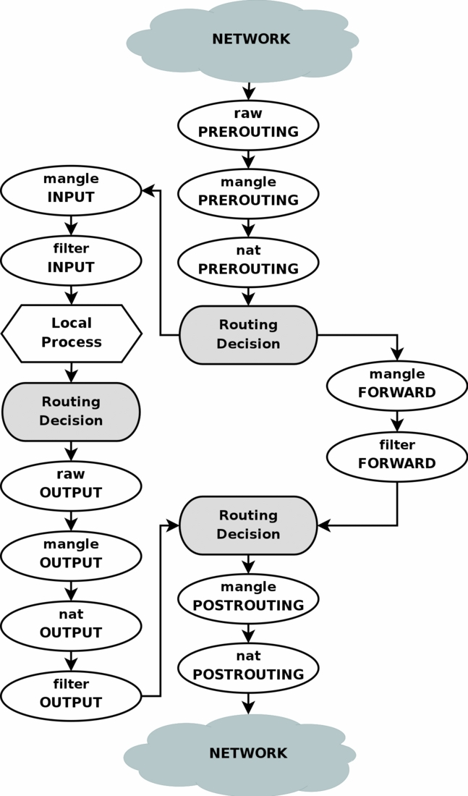

+++
title = "网络分析"
date = "2021-02-12T15:09:23+08:00"
author = ""
authorTwitter = "" #do not include @
cover = ""
tags = ["网络分析"]
keywords = ["网络分析"]
description = ""
showFullContent = false
+++

# 网络分析
本文记录了一些工作中常见的网络问题以及网络工具使用方法，包括：NAT是什么、tcpdump用法、connect超时等。

在 `linux` 上我们可以使用 `tcpdump` 来分析流量包，`wireshark` 分析包，`strace` 查看进程调用。
`fiddler` 用于分析 http 协议，`wireshark` 用于分析 tcp/udp 的网络封包

## https 包抓取
网络流量的这些工具为了能够解析 https 的包，通常都是自己签发证书，然后让系统信任自己证书，以作为中间人去转发、解析 https 流量。
如果仅仅只是为了代理 https 流量而不解析，可以使用 http 的隧道协议，使用 `CONNECT` method 去连接代理服务器，然后代理服务自动转发握手请求，相当于客户端直接与目标服务连接。

## NAT(Net Address Translation) 
NAT 常用于虚拟化技术中，又分为三类
- 静态NAT：此类NAT在本地和全局地址之间做一到一的永久映射。须注意静态NAT要求用户对每一台主机都有一个真实的Internet IP地址。
- 动态NAT：允许用户将一个未登记的IP地址映射到一个登记的IP地址池中的一个。采用动态分配的方法将外部合法地址映射到内部网络，无需像静态NAT那样，通过对路由器进行静态配置来将内部地址映射到外部地址，但是必须有足够的真正的IP地址来进行收发包。
- 地址端口NAT（NAPT）：最为流行的NAT配置类型。通过多个源端口，将多个未登记的IP地址映射到一个合法IP地址（多到一）。使用PAT能够使上千个用户仅使用一个全局IP地址连接到Internet。NAPT 又根据转换源头或者目标不同又分为 SNAT 和 DNAT。实现 NAPT 的常见手段是设备维护一张转换表，里面存储了由 源地址：端口 到 转换后地址：端口 的映射关系

> Tips:
> SNAT, DNAT, MASQUERADE都是NAT, MASQUERADE是SNAT的一个特例, SNAT是指在数据包从网卡发送出去的时候，把数据包中的源地址部分替换为指定的IP，而 MASQUERADE 则是用指定用网卡 IP 来替换。最开始了解 SNAT 和 DNAT 时觉得两者就是相互的，一旦产生了一个 SNAT，回包时就必须有 DNAT 的操作，但是事实上区分两者时是以发送数据包的动作来区分，而不是接收。因为路由是按照目的地址来选择的，因此DNAT是在PREROUTING链 上来进行，而SNAT是在数据包发送出去的时候才进行，因此是在POSTROUTING链上进行的

iptable, 和 ipvs 都有 NAT 的功能，它们使用 nf_conntrack 内核模块来跟踪各个映射关系，当被 syn_flood 攻击时，conntrack 表被写满也会导致新连接的包被丢弃。
```
// 查看 nf_conntrack 的最大数量
cat /proc/sys/net/netfilter/nf_conntrack_max

// 查看连接跟踪有多少条目
cat /proc/sys/net/netfilter/nf_conntrack_count

// 查看当前跟踪的详细信息
cat /proc/net/nf_conntrack
```

查看 当前数量

## tcpdump用法小结
### 常用选项
- `-i any` 可以抓取所有网卡流量
- `src/dst/host hostname` 抓取 来自(src) or 发往(dst)，且 host 为 hostname 的流量，host 选项为全抓
- `-s 0` 默认只抓取 68 字节，指定 0 可以抓取完整数据包
- `-X` 以十六进制 和 ACII 的方式查看数据包细节 `-A` 标识仅用 ACII
- `port 8080` 抓取端口 8080 的流量 如果和 src/dst/host 一起使用，需要 `and` 连接
- `tcp/udp port 8080` 指定 8080 端口的 tcp/udp 流量
- `-nn` 单个 n 表示不解析域名，直接显示 IP；两个 n 表示不解析域名和端口。这样不仅方便查看 IP 和端口号，而且在抓取大量数据时非常高效，因为域名解析会降低抓取速度
- `-C int` 限制单个采集文件的大小，单位 MB
- `-w fileanem` 采集到文件，注意这里采集的是包的原始信息，这个文件直接打开浏览的话会非常乱。一般都是配合 `-r file.cap` 来读取
- `-Z user` 指定tcpdump使用的用户，避免没有权限写入

### 输出分析
一般格式为
> TIME SRC > DST: Flags [.], data-seq, ack-seq, win, options, length

- TIME: 时间戳
- SRC: 源头
- DST: 目标地址
- Flags: 表示 TCP 数据包的标志位，F-FIN, S-SYN, .-ACK, S.-SYN+ACK, P.Push+ACK, R-RST 连接重置, 
- data-seq: 数据序列号，包括起始以及结束
- ack-seq: 已接受的序列号表示期望从其之后开始，
- win: 滑动窗口的缓存大小

## strace用法小结
当发现进程或服务异常时，我们可以通过strace来跟踪其系统调用，“看看它在干啥”，进而找到异常的原因。熟悉常用系统调用，能够更好地理解和使用strace。

Tips: 当目标进程卡死在用户态时，strace就没有输出了。
### 常用选项
- `-p` 指定要跟踪的进程pid, 要同时跟踪多个pid, 重复多次-p选项即可
- `-s 1024` 当系统调用的某个参数是字符串时，最多输出指定长度的内容，默认是32个字节
- `-tt` 在每行输出的前面，显示毫秒级别的时间
- `-o file.strace` 把strace的输出单独写到指定的文件, 使用 `-O` 可以把不同PID的文件分开
- `-f` 跟踪目标进程，以及目标进程创建的所有子进程
- `-T` 显示每次系统调用所花费的时间
- `-e trace=process` 控制要跟踪的事件和跟踪行为,比如指定要跟踪的系统调用名称


## 网络问题小记
### connect 超时
此类问题除了本身网络故障外最常见就是服务器接收 syn 包后不回导致的，不回 syn 包有几个可能的原因
- 内核的连接队列长度太小，导致高并发的情况下直接丢弃了 syn 包
- 使用了 `net.ipv4.tcp_tw_recycle` 功能，并且 client 端做了 NAT
- 母机软中断打满(top中的 si)，导致没法响应
- 如果使用了 ipvs：母机 conntrack 表写满，导致丢包，可以查看 `net.ipv4.ip_conntrack_max` 参数
- 网卡带宽打满 or 发包量过大(网卡稳定性导致,万兆卡一般在28W以上就要注意)

想要确认内核丢弃了多少包可以使用以下命令：
```bash
netstat -s | egrep "listen|LISTEN"
```

确认丢包是由于 `net.ipv4.tcp_tw_recycle` 导致的可以使用:
```bash
netstat -s |grep rejec
```

**内核的连接队列长度太小**
这里要介绍些背景：
- linux 中 tcp 的握手是由内核来完成的，完成后会将连接放入队列中等待用户程序使用
- 队列分为两个 半连接( SYN-RCVD )队列 和 全连接( ESTABLISHED )队列，用户程序调用 accept 系统调用时会从全连接队列中读取
- SYN queue ，长度由 `tcp_max_syn_backlog `和 `net.core.somaxconn `和 业务tcp调用 `listen(fd, backlog)`的 backlog 三者最小值决定
- ACCEPT queue ， 长度由 `net.core.somaxconn` 和 `listen(fd, backlog)` 的backlog两者最小值决定

Linux 的 Server 在处理 syn 包时的顺序：
- 检测全连接队列，放入半连接队列，等待 ack
- 检测全连接队列，从半连接队列中取出，放入全连接队列

接下来的事情就很容易理解了，比如旧系统的参数设置为 `128`，那么在流量突增的情况下，大于 128 的连接就都会被丢弃掉从而导致客户端超时。

错误信息：
- 全连接队列满了：xxx times the listen queue of a socket overflowed
- 半连接队列满足：xxx SYNs to LISTEN sockets dropped

**使用了 `net.ipv4.tcp_tw_recycle` 功能，并且 client 端做了 NAT**
通常来说主动断开连接的一方会进入 `TIME_WAIT` 状态（为了处理对端的 FIN 重传报文），等待 2个MSL时间后才会释放，但是如果开启了 `net.ipv4.tcp_tw_recycle` 功能，那么内核会记录每个连接的所携带的时间戳（注意这个功能依赖 `net.ipv4.tcp_timestamps` 开启，开启后双发都会携带一个时间戳，可以便于计算准确的 RoundRripTime, 定义在 RFC1323 ），当同一IP的 syn包时间戳晚于上一次数据包则丢弃，否则直接复用这个socket，通常来说这没什么问题，但是如果 client 使用了 LVS 来转发的话，由于它不会修改数据包的时间戳，并且做了 SNAT，所以在 server 很容易由于不同机器的时间差而触发丢弃。
另外值得一提的是 `tcp_tw_reuse` 参数，可以在保证安全的前提下做类似的事情，但是它只对 client 端生效

解决方法是关闭 Server 端的 `net.ipv4.tcp_tw_recycle` or 关闭 client 端的 `timestamp`

`net.ipv4.tcp_timestamps` 的作用：
- **精确计算RTT(Round-Trip Time)**: 在没有时间戳时计算RTT使用的方法是在包发送时记录下时间，RTT为收到ACK的时间减去发送时记录的时间。这种方法在出现丢失重传时，会导致RTT计算出现偏差，因为不确定ACK的回包是因为收到了最开始发的包，还是收到了重传后的包。而时间戳选项可以很方便的使用TSecr来计算精准的RTT，当然，由于TSval并非真正的时间戳，所以计算时并非直接相减，而是使用相应的算法计算出RTT。
- **PAWS(Protection Against Wrapped Sequence numbers)**: TCP的头部信息中序列号占用4个字节，即每传输4G的数据之后，序列号又要从头开始了(考虑到开始时随机选取的序列号，这个数字一般比4G小)。考虑在一个高速网络中，某一个数据包A发生了超时重传，过了一段时间，此时序列号已经过了一轮又回到A了，之前丢失的包如果此时被收到就会被当成合法的包加以使用，这就是PAWS要解决的问题。在添加了时间戳的选项的包中，PAWS在处理逻辑中添加了一条如下规则：如果收到的包的TSval小于最近一次收到的时间戳，则认为是不合法的，这就保证之前的包不会被当成合法的包。(这中间还有一些细节的处理，比如何时更新最近一次收到的时间戳，对于重传情况的处理等，可以参考具体的RFC文档)


### 其他网络相关的内核参数
- `net.core.wmem_default`, `net.core.rmem_default`: 读写网络栈的 buffer 大小，会影响吞吐性能
- `net.ipv4.tcp_syncookies`：开启 synccookie 功能，开启后如果请求积压超过半连接的队列，那么将会把请求信息进行 hash 后作为 SEQ 返回 client，client 回复 ack 时在半连接队列中找不到这个信息将会走入检查 SEQ 是否为序列化的，如果匹配则继续，否则拒绝，这个功能是为了针对 syn-flood 攻击而设计。

### 提升 tcp 连接最大数量
参考：[increasing-the-maximum-number-of-tcp-ip-connections-in-linux](https://stackoverflow.com/questions/410616/increasing-the-maximum-number-of-tcp-ip-connections-in-linux)
#### Client
- 提升端口范围，降低 `tcp_fin_timeout`: ip_local_port_range 定义可用的端口范围 min ~ max, tcp_fin_timeout 指定 tcp 结束时间
```
sysctl net.ipv4.ip_local_port_range
sysctl net.ipv4.tcp_fin_timeout
```
- 使用 `tcp_tw_recycle`, `tcp_tw_reuse` 来重用端口，但请注意 recycle 在 NAT 网络可能引起丢包的问题
- 通过 ulimit 查看 打开文件数是否受限

#### Server
- somaxconn, netdev_max_backlog, tcp_max_syn_backlog 这三个值限制了全/半连接的队列长度

## iptables小结
通常我们在 linux 下使用的 `iptables` 命令其实只是一个配置工具，背后真正执行的内核模块是 `netfilter`，他们两构成了 linux 的防火墙。
`iptables` 的关键组成为：Table, Chain, Rule，后者都是前者的组成部分，值得注意的是 Table 只能通过修改内核功能来添加，你只能通过命令行创建 Chain 和 添加 Rule，Linux 默认创建了三个表
- raw: 此表中的数据包不做任何处理
- mangle： 用于修改数据包
- nat：执行 NAT 相关的操作，docker就会在NAT表中创建规则，将 bridge 网络中的请求全都执行 SNAT
- filter：执行命令行时的默认表

按执行的先后顺序，存在以下几个阶段：
- PREROUTING: 当数据包从网卡出来后所经理的第一个阶段，在此阶段工作的
- INPUT: 如果数据包是由本机处理的，那么进入此阶段
- FORWARD: 如果数据包是要转发到其他机器的，进入此阶段
- OUTPUT: 如果数据包由本机发出，进入此阶段
- POSTROUTING: 当数据包进入网卡之前的最后一个阶段

可以看出 `PREROUTING`、`POSTROUTING` 两个阶段是一定会执行的，所以 NAT 操作几乎也都发生在这里， 流程图可以参考：

